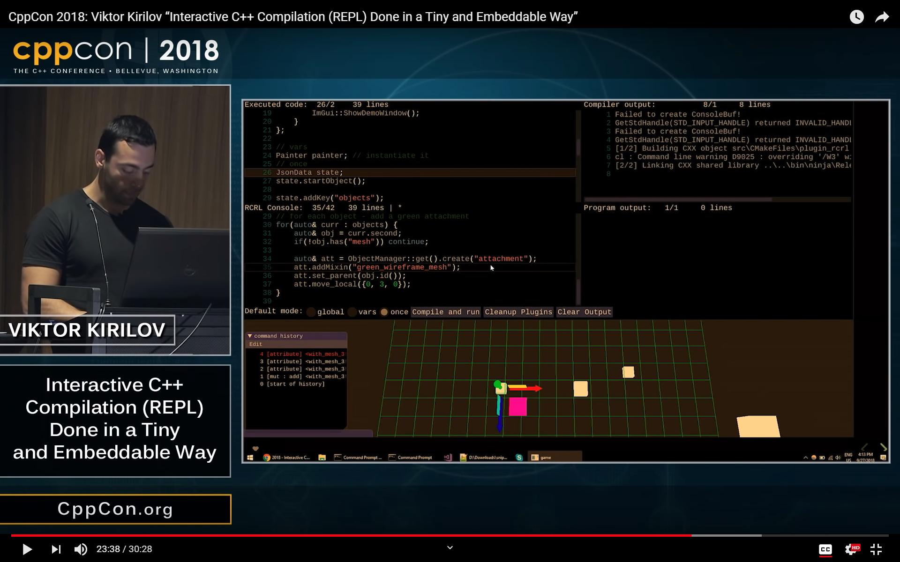

# The best game engine ever

[](https://ci.appveyor.com/project/onqtam/game/branch/master)
[](https://travis-ci.org/onqtam/game)
[](https://isocpp.org/)
[](http://opensource.org/licenses/MIT)

This was meant to become the most awesome C++ game engine (in terms of the object model and iteration speed).

Here are the key R&D innovations of this engine:
- automatic code generation of serialization & GUI binding routines for classes thanks to the static reflection - based on the technique from [this project](https://github.com/onqtam/cmake-reflection-template) (but moved from a hacky Python script to using [LibClang](https://clang.llvm.org/docs/Tooling.html#libclang) to parse the C++) - [DRY](https://en.wikipedia.org/wiki/Don%27t_repeat_yourself)!!!
- a very flexible object model where polymorphic objects can be composed at runtime (with the help of [dynamix](https://github.com/iboB/dynamix) which helps separate the interface from the implementation) and each component can be built into a separate shared object
- thanks to the 2 things above you could modify almost any part of the code and recompile it without having to stop the running engine - it would magically pick up the changes - this is achieved by: 1) serializing the components of all objects which will be reloaded, 2) removing those components from the objects, 3) reloading the shared objects which define the components, 4) recreating the components in the objects, and 5) deserializing the state into them - with the ability to add or remove fields from classes/structs (changing the memory layout)! Even entire subsystems are reloadable (like the Editor) and can be developed while the engine is running!
- integrated [RCRL](https://github.com/onqtam/rcrl) (a REPL for C++) and the entire engine API can be used - this was demoed at [CppCon 2018](https://youtu.be/UEuA0yuw_O0?t=1122)

[](https://youtu.be/UEuA0yuw_O0?t=1122)

Unfortunately it was really hard to convince any studio to pour resources into the development of a new engine - this was deemed too impractical in 2018... So I'm sorry to say the project has been abandoned.

## Building

You'll need:

- **Python 2.7/3.x**
    - you'll also need the ```colorama``` package - ```pip install colorama```
- **CMake 3.0** or newer
- Compilers (one of them)
    - **VS 2017**
    - **g++ 7**
    - **clang 5** (call ```export CXX=clang++``` before calling ```ha -g gcc```)
- you will also need LibClang - for windows install the 64 bit version in the default path from here: https://llvm.org/builds/
- Required packages for ubuntu: ```xorg-dev```, ```libx11-dev```, ```libgl1-mesa-dev``` (and probably others...)

Use the ```ha``` python script in the root of the repository to build the project (it has help). Emscripten requires **Python 2.7** and has been setup to work only on windows.

```
ha -s        # setup repository
ha -g msvc   # generate msvc solution
ha -b gcc    # build with gcc or clang (implicitly calls "ha -g gcc" to generate makefiles)
```
